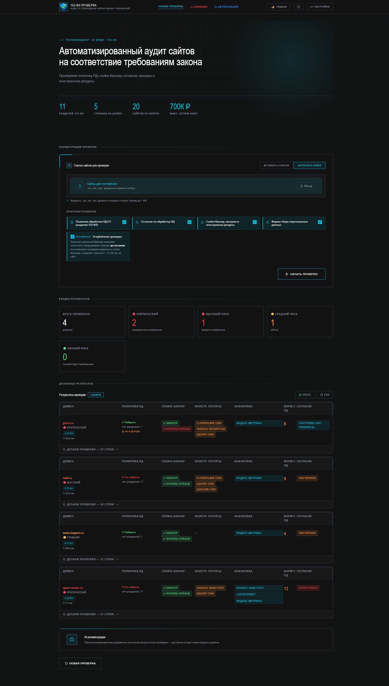
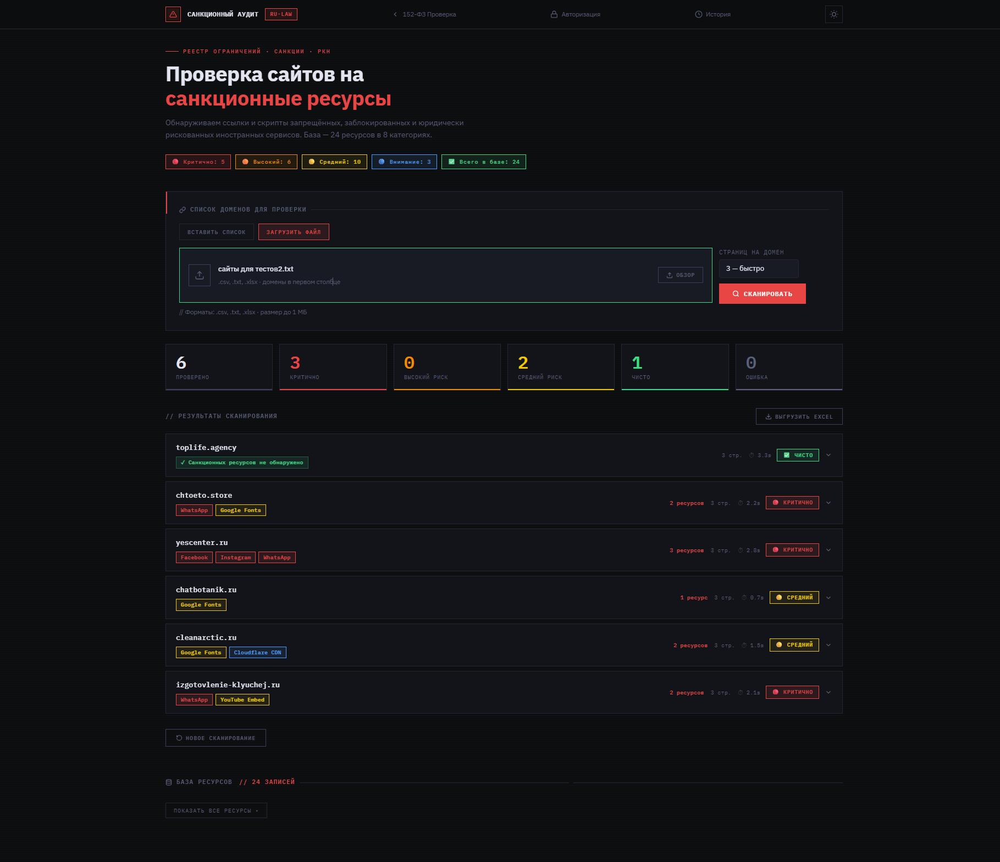
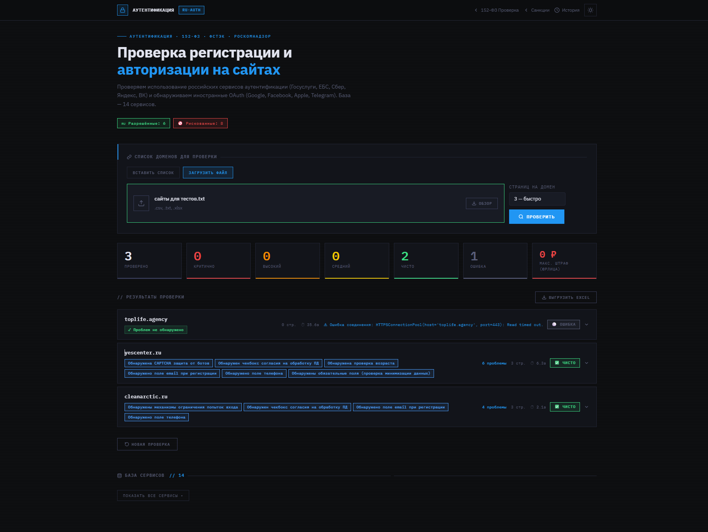
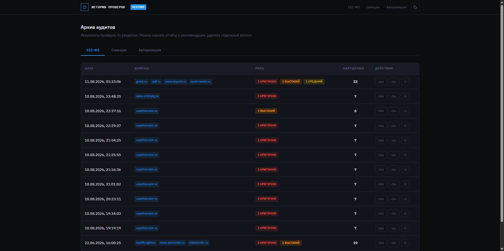
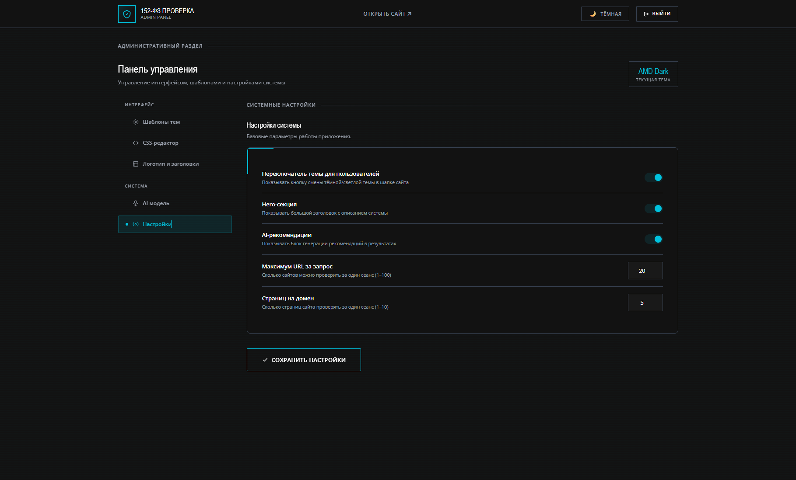

# double_sitechecker — аудит сайтов (152-ФЗ · санкции · авторизация)

Веб-приложение для автоматизированной проверки сайтов на соответствие
российскому регулированию:

| Модуль | URL | Назначение |
|--------|-----|------------|
| **152-ФЗ** | `/` | Политика ПД, cookie, формы, согласие, трекеры, риск/штрафы |
| **Санкции** | `/sanctions` | Meta, заблокированные сервисы, CDN, платежи и др. |
| **Авторизация** | `/auth` | РФ-сервисы входа vs иностранный OAuth, 152-ФЗ при регистрации |
| **История** | `/history` | Архив аудитов с выгрузкой отчётов |
| **Админка** | `/admin` | Тема, лимиты, AI-модель, брендинг |

**Стек:** Python 3.10+ · Flask · BeautifulSoup · Playwright · OpenAI-совместимый API · python-docx

---

## Скриншоты

### Проверка по 152-ФЗ



### Санкционный аудит



### Авторизация и регистрация



### История проверок



### Админ-панель



---

## Возможности

### 152-ФЗ (`/` · `checker.py`)
- Политика обработки ПД (11 обязательных разделов ст.14 152-ФЗ), футер, PDF
- Cookie-баннер, кнопка отказа, предустановленные галочки
- Аналитика: Яндекс.Метрика (РФ), Google Analytics / Meta Pixel / Hotjar и др. (иностранные = трансграничка)
- Иностранные ресурсы: Google Fonts, reCAPTCHA, CDN и т.п.
- Формы сбора ПД (в т.ч. JS-формы без `<form>`), согласие по ст.9
- Многостраничный обход (до 5 страниц на домен)
- Playwright: трекеры до согласия, скрытые баннеры, `element.checked`, скриншоты
- AI-рекомендации и ТЗ разработчику (.docx, SSE-стриминг)
- Оценка риска и ориентиры по штрафам КоАП РФ

### Санкции (`/sanctions` · `sanctions/`)
- База ~24 ресурсов в 8 категориях (Meta, banned, payment, CDN, ads, widgets…)
- Краулинг страниц, уровни риска, Excel-экспорт, AI-рекомендации
- Фильтрация ложных срабатываний на JS-шаблонах Tilda (соцсети «на будущее»)

### Авторизация (`/auth` · `auth/`)
- Разрешённые: Госуслуги/ЕСИА, Сбер ID, Яндекс ID, VK ID и др.
- Иностранный OAuth: Google, Facebook, Apple, Telegram Login и др.
- Согласия, CAPTCHA, возраст, MFA — по сигнатурам в HTML

### История и админка
- Сохранение результатов аудитов в SQLite (`history.db`) по разделам
- Скачивание Excel/CSV (в т.ч. пересборка из сохранённых данных)
- Удаление отдельных записей
- Настройки: тема, логотип, max URL / страниц, AI-модель

---

## Быстрый старт

```bash
# 1. Каталог проекта
cd double_sitechecker

# 2. Виртуальное окружение
python -m venv venv

# Windows
.\venv\Scripts\activate
# Linux / macOS
source venv/bin/activate

# 3. Зависимости
pip install -r requirements.txt

# 4. Playwright (для углублённой проверки 152-ФЗ)
# Windows:
python -m playwright install chromium
# Linux (часто):
# PLAYWRIGHT_BROWSERS_PATH=0 python -m playwright install chromium

# 5. Переменные окружения (.env)
#    HUBRIS_API_KEY / HUBRIS_BASE_URL / HUBRIS_MODEL — AI (опционально)
#    ADMIN_PASSWORD — пароль админки
#    PORT — порт (по умолчанию 6001)

# 6. Запуск
python app.py
```

Открыть в браузере: **http://127.0.0.1:6001**  
(порт `6001` — Chrome блокирует 6000 как unsafe; переопределение: `PORT=8080 python app.py`)

История и админка: `/history`, `/admin` (нужен `ADMIN_PASSWORD`).

---

## Требования

- Python 3.10+
- Playwright + Chromium (модуль 152-ФЗ, углублённая проверка)
- API-ключ совместимого с OpenAI endpoint (Hubris / router и т.п.) — только для AI-рекомендаций

---

## Структура проекта

```
double_sitechecker/
├── app.py                 # Flask: 152-ФЗ, SSE, админка, API истории
├── app_sanctions.py       # Blueprint санкционного аудита
├── app_auth.py            # Blueprint проверки авторизации
├── checker.py             # Проверка 152-ФЗ (requests + Playwright)
├── config.py              # Ключевые слова, лимиты, AI config
├── deepseek.py            # AI-рекомендации 152-ФЗ
├── rec_report.py          # .docx для 152-ФЗ
├── report.py              # Excel / CSV
├── history.py             # SQLite-история аудитов
├── history.db             # БД истории (создаётся автоматически)
├── requirements.txt
├── example_sites.csv
├── docs/                  # Скриншоты для README
│
├── sanctions/             # Модуль санкций
│   ├── checker.py
│   ├── sources.py
│   ├── prompts.py
│   └── rec_report.py
│
├── auth/                  # Модуль авторизации
│   ├── checker.py
│   ├── sources.py
│   ├── prompts.py
│   └── rec_report.py
│
├── prompts/               # Промпты и knowledge base (152-ФЗ)
│   ├── system_prompt.txt
│   └── knowledge/
│
├── templates/             # index, sanctions, auth, history, admin
├── static/                # app.js, CSS, шрифты, логотипы
│
├── uploads/               # Загруженные списки URL
├── reports/               # Excel/CSV
├── recommendations/       # .docx AI
└── screenshots/           # Скриншоты Playwright
```

---

## Формат входных данных

- **Текст** — по одному домену/URL на строке
- **CSV / TXT** — домены в первом столбце
- **XLSX** — домены в столбце A

Лимит URL за запрос задаётся в админке (по умолчанию до **50**, часто 20).

---

## Критерии 152-ФЗ

| № | Критерий | Что проверяется |
|---|----------|-----------------|
| 1 | Политика ПД | Ссылка (в т.ч. `/politika-pd/`), футер, 11 разделов ст.14, реквизиты оператора, PDF |
| 2 | Cookie и метрика | Баннер, отказ, галочки, аналитика, иностранные ресурсы |
| 3 | Формы с ПД | phone/email/имя, JS-формы, дедупликация между страницами |
| 4 | Согласие | Чекбокс, реквизиты ст.9, `element.checked`, совмещение с рассылкой |
| — | Playwright | Трекеры до согласия, скрытый баннер, скриншот, JS-формы |

### Аналитика vs трансграничка

| Системы | Аналитика | Трансграничная передача |
|---------|-----------|-------------------------|
| Яндекс.Метрика, LiveInternet, Roistat | да | **нет** |
| Google Analytics, Meta Pixel, Hotjar, SimilarWeb | да | **да** |
| Google Fonts, reCAPTCHA, CDN… | — | **да** |

Сигнатуры GA не используют голый `dataLayer` (на Tilda это stub без GA).

---

## Многостраничная проверка

До **N страниц** на домен (админка / `max_pages`):

1. Полная проверка стартовой (с Playwright при включении).
2. Краулинг внутренних ссылок (приоритет: контакты, услуги, заявка…).
3. Доп. страницы — аналитика, формы, согласие.
4. Слияние: лучшая политика, union аналитики/foreign, дедуп форм, max риск.

Пропускаются: login/register, cart, admin, sitemap, pdf, `tel:`, `mailto:`, якоря.

---

## Оценка риска (152-ФЗ)

| Уровень | Ориентир score |
|---------|----------------|
| 🔴 КРИТИЧЕСКИЙ / ВЫСОКИЙ | крупные штрафы (иностранные ресурсы, трекеры до согласия…) |
| 🟡 СРЕДНИЙ | частичные нарушения cookie/политики |
| 🟢 НИЗКИЙ | существенных нарушений нет |

Ориентиры штрафов — ст.13.11 КоАП РФ (до сотен тысяч ₽ в зависимости от состава).

---

## Отчёты и AI

- **Excel / CSV** — сводка и детализация; из UI и из истории
- **DOCX** — рекомендации владельцу и/или ТЗ разработчику (после AI-генерации)

Пример `.env` для AI:

```env
HUBRIS_API_KEY=sk-...
HUBRIS_BASE_URL=https://api.hubris.pw/v1
HUBRIS_MODEL=qwen/qwen3.5-flash-02-23
# Лимит длины ответа (по умолчанию 16384):
# AI_MAX_TOKENS=16384
ADMIN_PASSWORD=change-me-in-production
PORT=6001
```

Без API-ключа проверки работают, блок AI-рекомендаций — нет.  
Модель также можно задать в админке (вкладка «AI модель»).

---

## Ограничения

| Параметр | Типичное значение |
|----------|-------------------|
| URL за запрос | 20–50 (админка) |
| Страниц на домен | 1–10 (админка, 152-ФЗ часто 4–5) |
| Таймаут requests | ~10 с |
| Таймаут Playwright | 20 с |
| Макс. размер файла списка | 1 МБ |
| TTL in-memory job | 1 ч (файлы истории сохраняются отдельно) |

---

## Nginx + Gunicorn (пример)

```nginx
server {
    listen 80;
    server_name yourdomain.ru;
    client_max_body_size 2M;

    location / {
        proxy_pass http://127.0.0.1:5000;
        proxy_set_header Host $host;
        proxy_set_header X-Real-IP $remote_addr;
        proxy_read_timeout 120s;
    }
}
```

```bash
pip install gunicorn
gunicorn -w 2 -b 127.0.0.1:5000 app:app
```

---

## Полезные заметки

- Подробности архитектуры: [`TECHNICAL.md`](TECHNICAL.md)
- Алгоритм модуля авторизации: [`AUTH_CHECK_ALGORITHM.md`](AUTH_CHECK_ALGORITHM.md)
- Методические материалы: каталог `additionals/`
- Активация venv в PowerShell: `.\venv\Scripts\activate.bat` (или `& .\venv\Scripts\Activate.ps1`)
